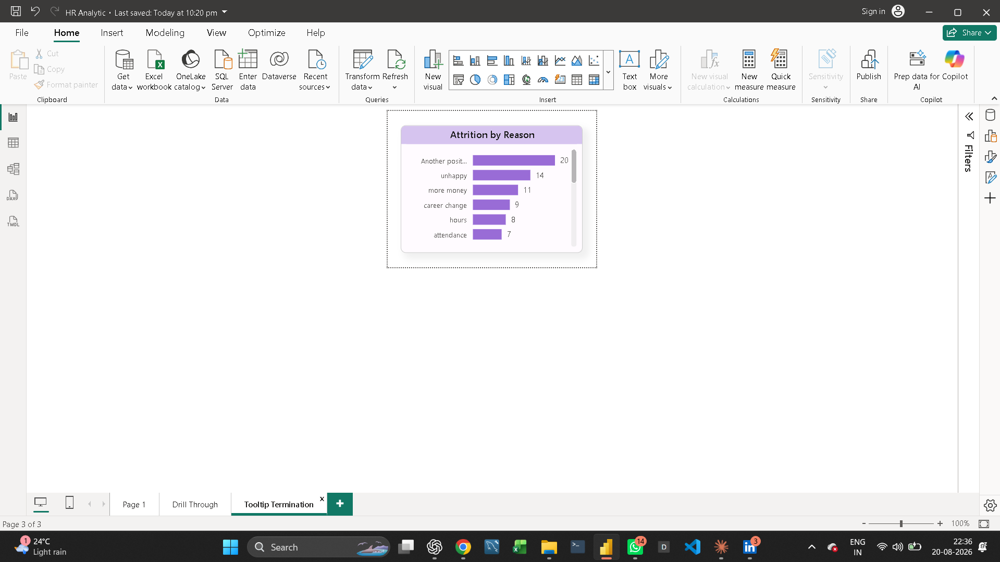
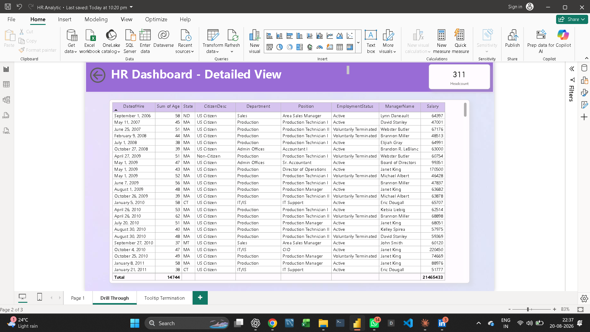

# HR Analytics Dashboard | Power BI

# Project Overview

This project is an interactive HR Analytics Dashboard developed using Microsoft Power BI.

The dashboard helps HR teams and management analyze employee information, workforce demographics, salary trends, job roles, departments, and employee attrition.

The objective of this project is to transform raw HR data into meaningful business insights that can support better workforce planning and HR decision-making.

---

#  Business Problem

HR departments need a clear view of their workforce to understand:

- How many employees are currently working in the organization?
- Which departments and job roles have the highest number of employees?
- How is the workforce distributed by gender and age?
- What is the employee attrition rate?
- Which departments or employee groups have higher attrition?
- How are employees distributed across salary ranges?
- What factors may be associated with employee turnover?

The dashboard provides an interactive way to answer these questions.

---

# Tools & Technologies

- Microsoft Power BI
- Power Query
- DAX
- Microsoft Excel
- Data Visualization
- Data Cleaning & Transformation

---

# Dataset

The project uses an HR employee dataset containing employee-level information.

The dataset includes information related to:

- Employee details
- Department
- Job role
- Gender
- Age
- Salary
- Job satisfaction
- Years at company
- Attrition
- Other employee-related attributes

---

# Key KPIs

The dashboard includes important HR KPIs such as:

- Total Employees
- Attrition
- Attrition Rate
- Average Employee Age
- Average Salary
- Average Years at Company

These KPIs provide a quick overview of the organization's workforce.

---

# Dashboard Analysis

The dashboard provides analysis through interactive Power BI visuals.

# Workforce Overview

Provides a high-level view of the organization's employee population.

# Employee Demographics

Analyzes employees based on:

- Gender
- Age
- Department
- Job Role

# Attrition Analysis

Analyzes employee turnover and helps identify areas with higher attrition.

# Salary Analysis

Provides insights into employee salary distribution and salary-related patterns.

# Department & Job Role Analysis

Allows users to compare workforce distribution across departments and job roles.

---

#  Project Workflow

The project was developed using the following data analytics workflow:

1. Understand the business problem
2. Collect and inspect the HR dataset
3. Clean and transform the data using Power Query
4. Create calculated columns and measures using DAX
5. Build KPIs
6. Create interactive visualizations
7. Apply dashboard formatting and design
8. Add filters and interactions
9. Analyze HR trends and patterns
10. Present insights through an interactive dashboard

---

# Dashboard Preview

)

---

# Key Insights

The dashboard can help HR management identify:

- Workforce distribution across departments
- Employee demographics
- Attrition patterns
- Salary distribution
- Job-role workforce concentration
- Areas that may require HR attention

---

#Skills Demonstrated

This project demonstrates practical skills in:

- Data Cleaning
- Data Transformation
- Power Query
- DAX
- KPI Development
- Data Visualization
- Dashboard Design
- Business Analysis
- Interactive Reporting
- HR Analytics

---

# Project Files

| File | Description |
|------|-------------|
| `HR Analytics 2.pbix` | Power BI dashboard project |
| `HRDataset_v14 (1).xlsx` | HR dataset |
| `# Dashboard Preview

' | Dashboard preview |

---

#Project Type

# Data Analytics / HR Analytics / Power BI

Built as a portfolio project to demonstrate practical data analyst skills using Microsoft Power BI.
